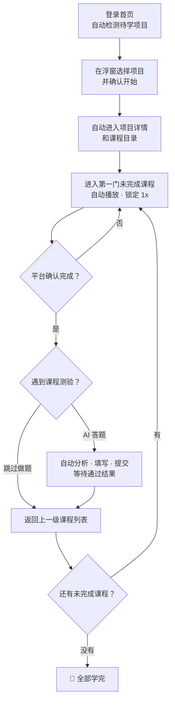

<div align="center">

# 🧭 KME 学习助手

**把「点开 → 等播完 → 返回 → 下一门」的机械重复交给浏览器，把时间还给你。**

[](https://github.com/skyjt/kmelearning-helper/releases/latest)
[](LICENSE)
[](https://github.com/skyjt/kmelearning-helper/releases/latest)
[](https://raw.githubusercontent.com/skyjt/kmelearning-helper/main/userscript/kme-learning-helper.user.js)

[下载最新版](https://github.com/skyjt/kmelearning-helper/releases/latest) ·
[油猴一键安装](https://raw.githubusercontent.com/skyjt/kmelearning-helper/main/userscript/kme-learning-helper.user.js) ·
[详细安装说明](INSTALL.md) ·
[完整更新日志](CHANGELOG.md)

</div>

---

## 这是什么

一个给 `pc.kmelearning.com` 学习页用的自动学习助手，提供 **Chrome 扩展（Manifest V3）** 和 **油猴脚本** 两个版本，功能完全一致。

它会在页面右下角放一个「学习助手」浮窗：登录后自动列出「我的任务」中的待学项目，经你确认后进入项目，按目录顺序播放课程、等待平台确认完成，并按你的设置跳过做题页或调用大模型完成测验。

**为谁而做：** 如果你是 **江苏农商行** 的员工，大概率对「学习地图」不陌生——一张图里排着几十门必修课，每一门都要手动点开、从头看到尾、等系统确认、再返回点下一门，一轮下来光是点击和干等就耗掉大半天。这个助手就是为这群人做的。它按平台规则**老老实实地以 1x 播放**，不跳过、不伪造完成，同样适用于其他跑在 `pc.kmelearning.com` 上的学习平台。

---

## 它是怎么工作的

平时你要做的事：找到未完成任务 → 进入任务 → 点「进入学习」→ 点开一门课 → 等它播完 → 返回列表 → 再点下一门……重复几十遍。助手把这套流程自动化：



- **它做的：** 减少重复点击，按平台规则播完每门课；遇到测验时将可见题目发送给你配置的模型，自动填写、提交，通过后继续学习。
- **功能边界：** 不倍速、不伪造完成状态、不读取平台隐藏答案字段；图片题、模型异常、回填失败或未通过时会停止自动学习。

> **为什么默认不倍速、不跳过？** 平台判断一门课是否完成，不只看视频有没有播到结尾，而是综合心跳、真实学习时长、播放进度和完成状态。第三方倍速插件就算把视频播完，也可能因真实时长不够而不算完成；拖进度条、跳过播放通常也过不了完成判断。本扩展锁定 1x、没确认完成就按 1x 补学，稳稳通过。

---

## 快速开始

### ① 选择安装方式

<details open>
<summary><b>方式一：油猴脚本（推荐）</b></summary>

1. 先安装 [Tampermonkey](https://www.tampermonkey.net/) 等用户脚本管理器。
2. 点击 [一键安装 KME 学习助手油猴版](https://raw.githubusercontent.com/skyjt/kmelearning-helper/main/userscript/kme-learning-helper.user.js)。
3. 在脚本管理器打开的安装页确认安装。
4. 打开或刷新 `https://pc.kmelearning.com/` 学习页面。

也可以到 [最新 Release](https://github.com/skyjt/kmelearning-helper/releases/latest) 下载 `kme-learning-helper.user.js`；如果浏览器只保存了文件，请在 Tampermonkey 的「实用工具」中从文件导入。油猴版会由脚本管理器自动检查更新。

</details>

<details>
<summary><b>方式二：Chrome 扩展</b></summary>

1. 下载最新版 [`kme-learning-helper-chrome.zip`](https://github.com/skyjt/kmelearning-helper/releases/latest/download/kme-learning-helper-chrome.zip)，解压到一个固定文件夹。
2. Chrome 地址栏进入 `chrome://extensions`。
3. 打开右上角的 **开发者模式**。
4. 点 **加载已解压的扩展程序**，选中解压后的文件夹（里面要有 `manifest.json`）。

ZIP 不能直接加载，必须先解压。更新时下载新包解压替换原文件，再回到 `chrome://extensions` 点扩展卡片上的刷新按钮。

</details>

> ⚠️ 同一个浏览器请只启用一个版本，避免运行状态和设置来源混淆。

### ② 开始学习

1. 登录 `pc.kmelearning.com`，回到首页，助手会自动展开并列出待学项目。
2. 列表没有及时更新时，点「待学项目」右侧的 **刷新**。
3. 点击准备学习的项目，在提示中点 **确认开始**。
4. 保持标签页打开——助手会按「播完 → 校验学习时长 → 测验或跳过 → 下一门」的顺序往下学。

也可以直接进入某个课程目录页，再点 **开始自动学习**，使用目录学习方式。

> 💡 浮窗可以最小化成右下角的小图标，点一下或鼠标移上去就能展开。

### ③ 选择做题方式

| 想要的方式 | 设置方法 | 运行结果 |
| --- | --- | --- |
| **暂时跳过做题页**（默认） | 保持「跳过做题页」开启 | 自动略过考试、测验、问卷和作业，继续处理可学习内容 |
| **AI 辅助、人工确认** | 开启「AI 自动答题」，关闭「全自动答题并提交」 | 模型给出答案、置信度和理由；你选择回填范围并自行提交 |
| **AI 全自动答题** | 开启「AI 自动答题」和「全自动答题并提交」 | 自动分析、回填、提交；通过后继续下一项，异常时停止并显示原因 |

「AI 自动答题」和「跳过做题页」互斥。第一次配置 AI 时，请先测试模型连接，再开始自动学习。

---

## 功能一览

| | 功能 | 说明 |
| --- | --- | --- |
| 📋 | **待学项目检测** | 登录首页后自动列出「我的任务」中的待学项目 |
| ✅ | **确认后进入** | 选择项目后先二次确认，再自动进入项目详情和课程目录 |
| 🪟 | **实时进度浮窗** | 在课程目录页实时显示当前目录的「课程进度」 |
| ▶️ | **自动播放** | 视频自动播放；文档 / 材料类页面保持活跃并等待完成标记 |
| 🔁 | **连续学习** | 一门课学完后自动返回课程列表，继续下一门 |
| ⏱️ | **学时校验补学** | 返回前检查「学习总时长」，不够课程要求就按 1x 继续补学 |
| 🤖 | **AI 自动答题** | 可配置 OpenAI-compatible 模型，提取单选、多选和判断题，自动填写并提交 |
| 🔄 | **通过后续学** | 测验通过后自动进入下一项；模型分析失败最多重试两次 |
| ⏭️ | **跳过做题页** | 不使用 AI 时，自动跳过考试、测验、问卷、作业 |
| 🏷️ | **标签页进度提示** | 自动学习时标签页标题实时显示「自动学习中 + 课程进度」，不用点开页面 |
| 🛡️ | **1x 稳过保障** | 默认抵消第三方倍速带来的「播完却不算完成」问题 |

### 设置项

点浮窗右上角的 **⚙**，卡片会**翻转**到背面的设置面；改完点「**完成**」翻回正面，改动即时生效：

| 设置 | 作用 |
| --- | --- |
| **自动播放** | 进入课程后自动开始播放视频 |
| **未完成自动补学** | 视频播完但平台没确认时，自动按 1x 重播补足 |
| **总时长达标再返回** | 返回列表前检查学习总时长是否达到课程要求 |
| **AI 自动答题** | 遇到测验时调用已配置模型；开启后自动关闭「跳过做题页」 |
| **全自动答题并提交** | 自动关闭须知、分析、填写、确认提交，并在通过后继续学习 |
| **跳过做题页** | 遇到考试 / 测验 / 问卷 / 作业自动跳过 |

> 「AI 自动答题」与「跳过做题页」互斥。视频按平台规则**固定以 1x 播放**（确保积累真实学习时长），这是核心行为，不是可关闭的开关。

---

## AI 自动答题

支持 **OpenAI-compatible Chat Completions** 接口，推荐使用油猴版：

1. 点浮窗右上角 **⚙**，开启 **AI 自动答题** 和 **全自动答题并提交**。
2. 填写完整接口地址（如 `https://example.com/v1/chat/completions`）、模型名称和 API Key；本机免鉴权接口可留空 Key。
3. 点 **测试模型连接**，确认可用后点「完成」返回正面。
4. 点 **开始自动学习**。视频和学习时长完成后，助手会自动进入测验、关闭须知、请求模型、填写全部有效答案并提交。
5. 平台显示通过后，助手会校验课程总学习时长；达标后继续下一项或返回课程列表学习下一门。

**安全与边界：**

- 全自动流程最多请求模型两次。模型未返回完整答案、图片题、回填失败、找不到提交按钮、结果未通过或超时都会**停止自动学习**，避免重复提交。
- API Key 默认只保留到当前页面刷新；开启「记住 API Key」后才写入本地存储。
- 发送给模型的内容限定为课程标题、页面可见题干和选项，**不包含**平台 Cookie、用户资料或隐藏判题数据。
- 当前版本暂不处理图片题，检测到时会停止 AI 分析并提示人工完成。

> 油猴首次访问新模型域名时会请求跨域授权，请核对目标域名、只允许你信任的服务。Chrome 扩展版使用浏览器 `fetch`，模型服务需正确配置 CORS——任意自定义接口优先使用油猴版。

---

## 演进计划

欢迎到 [Issues](https://github.com/skyjt/kmelearning-helper/issues) 一起讨论、提需求。

**近期**

- [ ] 更稳的页面识别，平台改版后能更快适配
- [ ] **进度看板**：一眼看清哪些学完、哪些没学、预计还要多久
- [ ] 学习记录导出（完成时间、累计时长）

**中期**

- [x] 🤖 **AI 自动答题**：接入用户配置的大语言模型，自动填写、提交并在通过后继续学习
- [ ] AI 图片题、多厂商原生协议和逐题追问
- [ ] 📝 **考试 / 自测助手**：讲解、错题回顾与知识点串讲，把刷题变成真正的复习
- [ ] 多课程批量队列、定时 / 分段学习
- [ ] 设置云同步，多设备保持一致

**远期设想**

- [ ] 适配更多学习平台
- [ ] 可配置的学习策略（播放速度、补学阈值、跳过规则等）

---

## 最近更新

最近一次更新（**v2.11.0**）：自动学习时标签页标题实时显示「自动学习中 + 课程进度」，不用点开页面就能在标签栏看到学到哪了；停止后恢复原标题。

| 版本 | 主要变化 |
| --- | --- |
| **v2.11.0** | 自动学习时标签页标题实时显示「自动学习中 + 课程进度」，停止后恢复原标题 |
| **v2.10.x** | 统一「项目 / 课程 / 小节」层级，精简首页浮窗，补齐「测试题」目录识别 |
| **v2.9.x** | 全自动答题、提交与通过后续学流程，优化异步结果判断 |
| **v2.8.x** | OpenAI-compatible 模型配置、连接测试和手动回填 |
| **v2.7.x** | 首页待学项目检测和自动进入流程，刷新记录后再校验学习时长 |
| **v2.6.0** | 新增油猴脚本版本，与 Chrome 版共用核心与双版本测试 |

完整的逐版本记录见 [CHANGELOG.md](CHANGELOG.md)；安装包和油猴脚本见 [GitHub Releases](https://github.com/skyjt/kmelearning-helper/releases/latest)。

---

## 常见问题

<details>
<summary><b>浮窗没出现？</b></summary>

确认你在 `pc.kmelearning.com` 的学习页，并刷新一次页面。第一次安装后已打开的页面需要刷新才会注入。

</details>

<details>
<summary><b>首页为什么没有「开始自动学习」按钮？</b></summary>

v2.10.0 起，首页以「选择待学项目」作为开始入口。直接点项目并确认即可；标题栏的「刷新」用于重新检测项目。进入课程目录后仍会显示「开始自动学习」按钮。

</details>

<details>
<summary><b>学了一会儿停住了？</b></summary>

平台页面结构更新可能导致识别失效。先刷新页面重试；仍有问题再更新扩展代码。

</details>

<details>
<summary><b>视频播放了，为什么「记录」里的学习总时长暂时没变化？</b></summary>

平台的「记录」页只在打开时请求一次数据，停留在该页时数字不会持续跳动。v2.7.1 起，助手会在课程完成校验前自动刷新该页，等最新总时长加载完成后再决定是否补学。

</details>

<details>
<summary><b>AI 模型连接失败？</b></summary>

确认接口地址包含完整的 Chat Completions 路径、模型名称准确，并检查 API Key、账户额度和油猴弹出的域名授权。远程接口必须使用 HTTPS，本机接口可使用 `localhost` HTTP。

</details>

<details>
<summary><b>Chrome 版能连接自定义模型吗？</b></summary>

可以，但模型服务需要允许浏览器跨域请求（CORS）。油猴版通过用户脚本权限发起请求，对自定义模型地址的兼容性通常更好。

</details>

<details>
<summary><b>全自动答题为什么停住了？</b></summary>

浮窗会显示停止原因。常见原因包括图片题、模型两次都没有返回完整 JSON、页面选项写入失败、提交按钮未识别、测验未通过或提交结果超时。修正配置或人工处理后，再点「开始自动学习」重试。

</details>

<details>
<summary><b>怎样更新到新版本？</b></summary>

油猴版会由脚本管理器检查更新，也可以重新点击一键安装链接。Chrome 版需要从 [最新 Release](https://github.com/skyjt/kmelearning-helper/releases/latest) 下载新 ZIP，解压替换原文件，再到扩展管理页点击刷新。

</details>

<details>
<summary><b>能配合倍速插件用吗？</b></summary>

不建议。平台会校验真实学习时长和心跳，倍速播完往往不算完成，反而拖慢进度。

</details>

---

## 开发

```bash
npm install                 # 安装依赖
npm test                    # 运行 Playwright 烟雾测试（提交前必须通过）
npm run build:userscript    # 重新生成油猴单文件
npm run icons               # 重新生成图标
```

打包本地安装用的 ZIP：

```bash
mkdir -p dist
COPYFILE_DISABLE=1 zip -X -r dist/kme-learning-helper-chrome.zip \
  manifest.json content.js styles.css icons
cp userscript/kme-learning-helper.user.js dist/kme-learning-helper.user.js
```

### 文件结构

| 路径 | 说明 |
| --- | --- |
| `manifest.json` | Chrome MV3 扩展配置（版本号以此为准） |
| `content.js` | 注入到学习页面的核心逻辑（含翻转设置面） |
| `styles.css` | 浮窗、翻转设置面和控件样式 |
| `icons/` | 扩展图标 |
| `userscript/kme-learning-helper.user.js` | 可直接安装的油猴单文件（自动生成） |
| `tests/extension-smoke.mjs` | 同时覆盖 Chrome 版和油猴版的 Playwright 烟雾测试 |
| `tools/build-userscript.mjs` | 从共享核心、样式和图标生成油猴单文件 |
| `tools/generate-icons.mjs` | 图标生成脚本 |

---

## 免责声明

请在遵守所在组织、平台规则和课程要求的前提下使用。本项目的全自动答题模式会把页面可见题目和选项发送到用户配置的模型接口，并代表用户填写和提交答案；不会发送平台 Cookie、用户资料或隐藏判题数据。

请只在允许自动化的练习或培训场景中启用该功能。模型答案可能出错，自动提交产生的结果和相关责任由使用者承担。

---

<div align="center">

**[MIT](LICENSE)** © KME Learning Navigator

</div>
